Open Hardware Assembly Instruction Kit
---
[« Back to README](../README.md)

# Ohai-kit Configuration
Ohai-kit can be configured using the **django.contrib.admin** application which should be installed by default under the *'^admin/'* URL.
You can point your browser to *http://mywebsite.com/admin/* and enter the administrator's username and password that you configured previously to get access to the Admin interface.

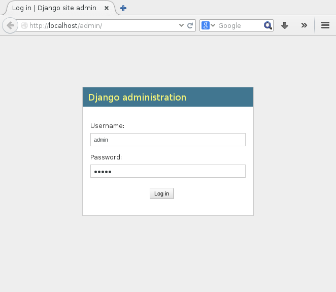

Once inside the Django administration interface, you can configure the various settings related to your ohai-kit installation, such as configuring groups and users, ohai-kit projects, project sets, work steps, job instances and work receipts.

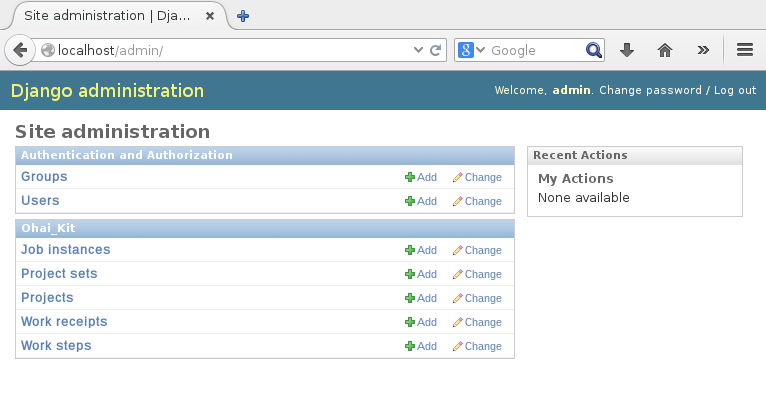

## Editing authentication settings
The ohai-kit users are handled by the **django.contrib.auth** application which should be installed by default. It can be configured through the Admin interface under the **Authentication and Authorization** section.

### Adding a group
You can create new groups to assign specific permissions to the users within that group. Click on the **Add** button next to the **Groups** option in the admin interface in order to create a new group. You can then give a name to the group and assign permissions to it. The various permissions will be sorted by application name (*ohai_kit*), configuration option (*project*) and permission (*Can add project*).

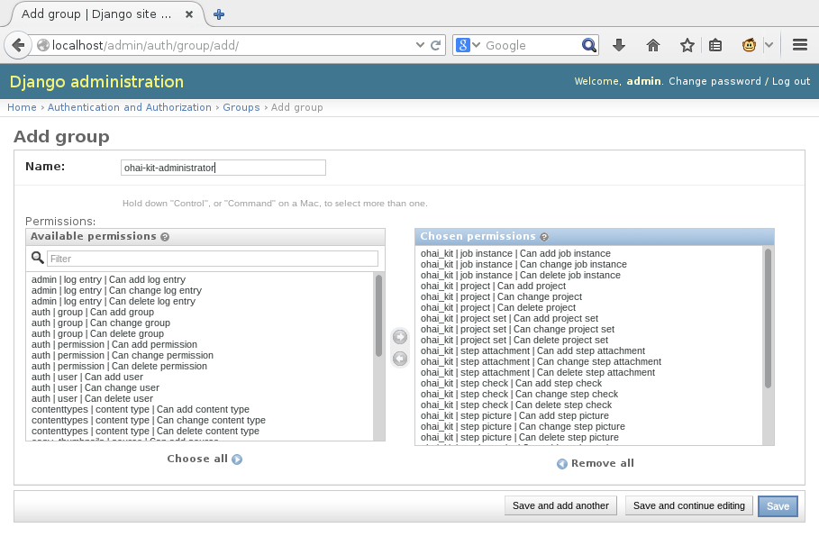

### Adding a user
You can create new users by clicking the **Add** button next to the **Users** option and assigning a username and password for the new user.

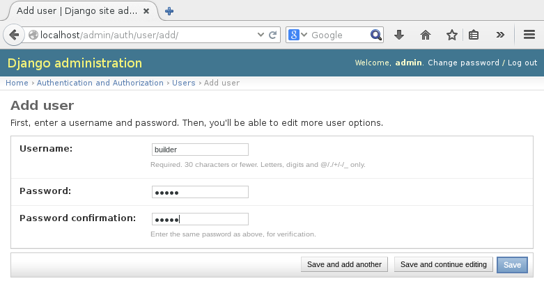

Once added, you can then change the user's settings, such as the name, email address and permissions.

To allow the user to login to the Administrator interface, you must enable the **Staff status** checkbox. This will only allow the user to login to the admin page, which will be empty. You will still need to assign specific permissions to the user to allow access to administrator's options.

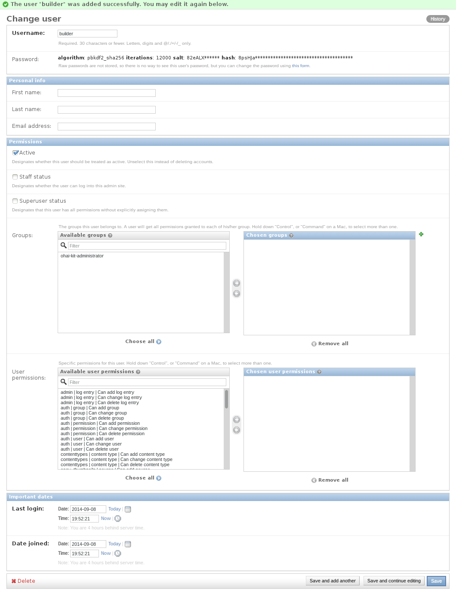

You can assign individual permissions to the user, or add the user to a group with the appropriate permissions. Note that an ohai-kit worker does not require any permissions to function.

### Guest mode
In order to enable the automatic guest mode view of ohai-kit, you must edit the **myproject/settings.py** file in your django project's directory and add the following line :

`OHAIKIT_GUEST_ONLY= True`

This will disable the login screen from ohai-kit and will automatically log any visitors as guest.
If the option is enabled, then workers will be required to use the **accounts/login/** URL to access the login page and login into their accounts instead of as *Guest*, for example http://mywebsite.com/accounts/login/

## Understanding Ohai-kit's configuration

Ohai-kit uses the concept of *Guest* and *Worker*. A *Guest* is a visitor to your website who simply wishes to view instructions for assembling the hardware that you provide. A *Worker* however is an authenticated user who needs to assemble a machine and keep track of the progress of their work.

When you enter the administration interface, you will notice 5 options in the Ohai_kit section : *Job Instances*, *Project sets*, *Projects*, *Work receipts* and *Work steps*.

The first option that you will need is the **Projects** option where you define the various projects that need to be built. This represents a single independent entity that needs to be built for your hardware, like for example *Assemble the enclosure* or *Assemble the frame*.

The second option is of course the **Work steps** option, where you will define the various steps required to build a single **project**, like for example *Gather the tools*, *Insert item X into Y* or *Tighten the screws*.

Finally, the third option is the **Project sets**, this is a way to group your various **Projects** into a single set. For example, you could have many projects for building the various parts of a single machine, and a **Project set** to group all of them into a single set called *My machine*.

To summarize, you will have a **Project set** for your machine, containing **Projects** for each individual part of the machine that needs to be assemble, and each project will contain various **Work steps** to identify the steps required to build that project.

You do not need to group projects into a project set. If there are no **Project sets** in your database, ohai-kit will show you all of the available projects in the main page, which is called the **Dashboard**. If there is at least one Project Set, then the *dashboard* will show you the available sets instead. In that case, any project that does not belong to a Project Set will automatically appear in an additional set called "**Miscellaneous**". 

When a *worker* starts assembling a *project*, ohai-kit will keep track of which worker assembled which project, when, and which steps he did exactly. This is to ensure that you can keep a log of who build what and whether everything was built to spec and that no steps were missed. You will also be able to know at what time each step was completed which can be useful in determining the time required to build a machine by the workers.

## Creating Projects
To create a project, click on the **Add** button next to the **Projects** option in the admin interface.

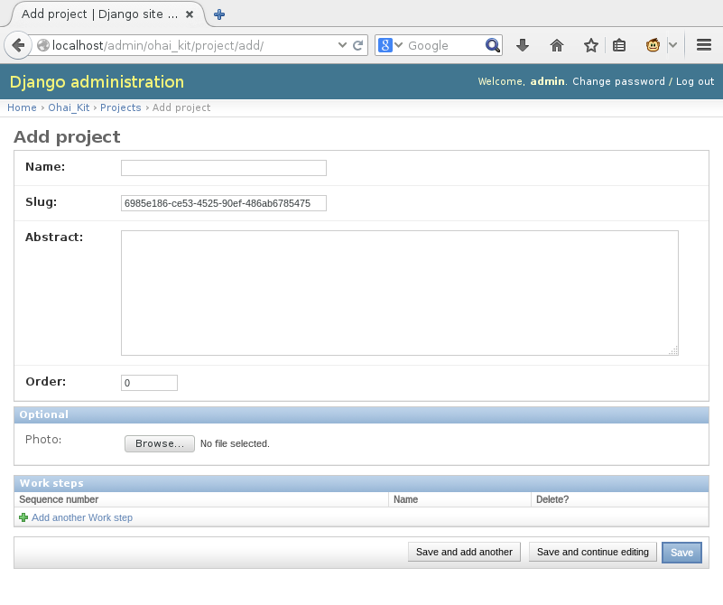

In the *Add Project* page, you will need to give a *name* to the Project, which will represent what the project is exactly, for example, "*Control Box Fan Assembly*" and a description. You can also optionally set a Photo for it and start creating steps.

* *Name*: The name of the project
* *Slug*: An auto-generated random unique identifier for the project. You do not need to modify it
* *Abstract*: A description of the project's purpose
* *Order*: The order in which this project will appear within the *Project Set*
* *Photo*: Optional thumbnail image for the project.
* *Work steps*: You can add here simple work steps, assign a sequence number and a name for them. You should later edit them in the **Work steps** option of the admin interface.

## Creating Work Steps

To create a new work step, you can either add it in the *Project* configuration page, or by clicking on the **Add** button next to the **Work steps** option in the admin interface.

If you create a work step from within the *Project* page, you will only be able to set the sequence number and the name, so you will need to edit it later to set the additional required options.
In order to edit existing work steps, click on the **Change** button next to the **Work steps** option in the admin interface.

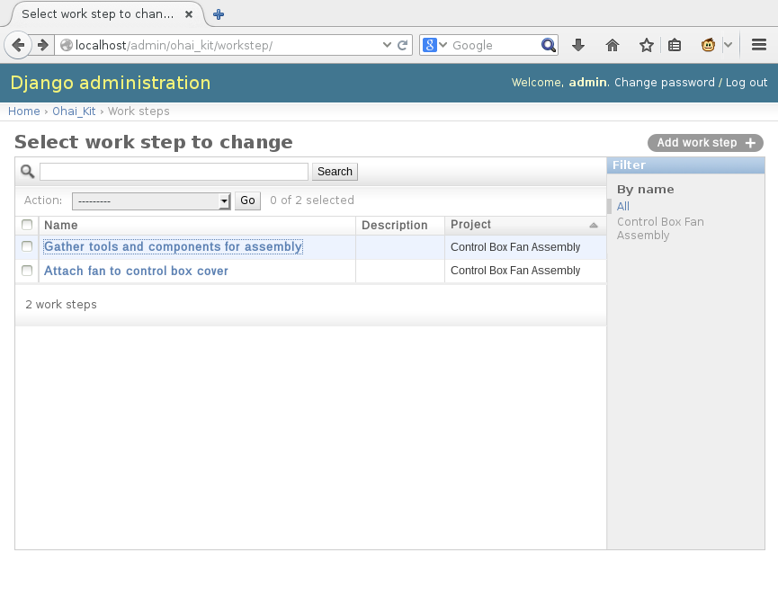

This page will list all the existing work steps ordered by project and sorted by sequence number. On the right, you can filter the results to only show work steps from a specific project by clicking on the project's name.

Once you select a work step, you will then be able to modify it.

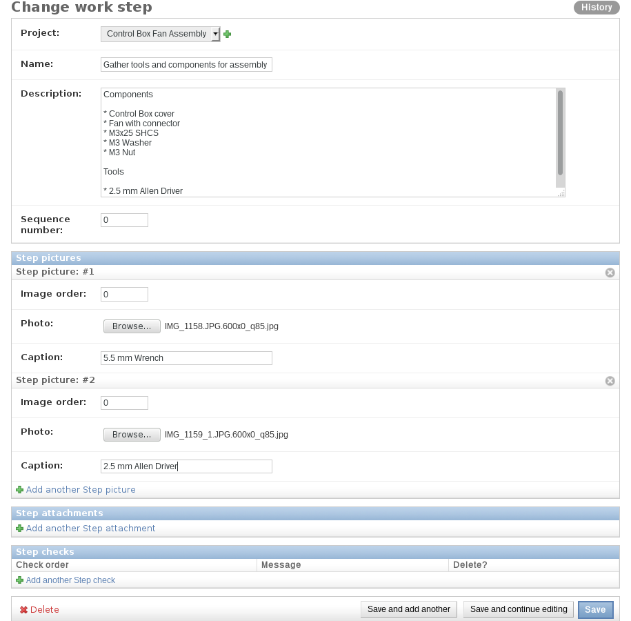

When editing a work step, you can select the project it belongs to and set a long description which supports the [markdown language](https://help.github.com/articles/markdown-basics). You can also add pictures and videos to the work step.
One thing to note is the *Step Checks* section, which allow you to set custom messages of items the worker needs to check before going to the next step, such as *Are all the screws tightened* and *Verify the parts are aligned correctly*. You can add any number of step checks that you feel is required. If none are defined, a simple _"Next"_ check gets added.

* *Project*: The project this work step belongs to
* *Name*: The name of the work step
* *Description*: A long description of what needs to be done in this step. This description supports the [markdown language](https://help.github.com/articles/markdown-basics) for extra formatting options.
* *Sequence number*: The order in which this step appears in the project compared to other steps.
* *Step pictures*: Pictures to show the required components or how this work step should be performed
 * *Image order*: The order of this image within this work step
 * *Photo*: The image file
 * *Caption*: The caption of the image
* *Step attachments*: File attachments to provide with this step. Currently this option only supports video attachments to show how this work step should be performed (see below)
 * *Order*: The order of this attachment within this work step
 * *Attachment*: The file to attach to this work step
 * *Thumbnail*: An optional thumbnail image for the file attachment
 * *Caption*: The caption for this file attachment
* *Step checks*: The checks that need to be performed before this step is marked as completed
 * *Check order*: The order of this check within this work step
 * *Message*: The message to be checked for

Note that the current implementation only accepts video attachments for the *Step attachments* option. The file being attached must be in WebM format using VP8 and Vorbis codecs and must have the *.webm* file extension. If the file does not have the *.webm* file extension, it will not appear on the work step and will be ignored. In the case of video files, the Thumbnail image for the step attachment will be ignored.

## Creating Project sets

To create a project set, click on the **Add** button next to the **Project sets** option in the admin interface.

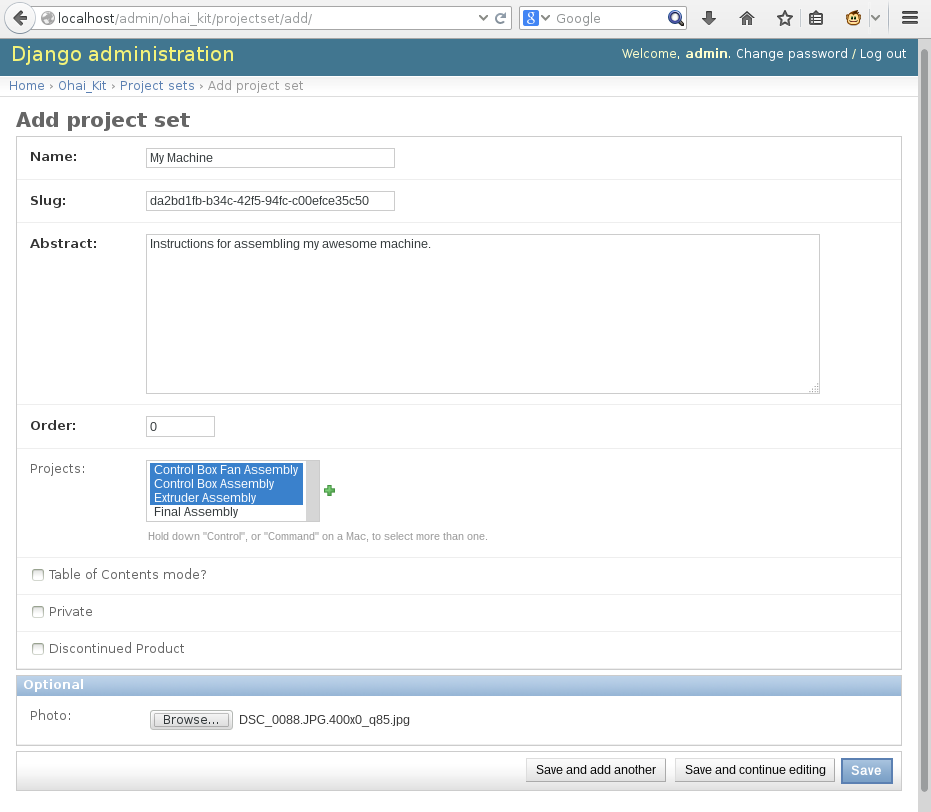

In the *Add Project set* page, you will need to give a *name* to the Project set, which will represent what the machine is that the projects of the set belong to, for example, "*My machine*" or "*My 3D Printer*" and a description. You will also need to select which projects belong to the project set and optionally define a few additional options. You can also optionally set a Photo for it to be shown in the _dashboard_.

* *Name*: The name of the project set
* *Slug*: An auto-generated random unique identifier for the project set. You do not need to modify it
* *Abstract*: A description of the project set.
* *Order*: The order in which this project set will appear within the *Dashboard*
* *Projects*: The list of projects contained within this project set. You can select multiple project by dragging your mouse or using the *Control* or *Command* button of your keyboard
* *Table of Contents mode?*: Sets the project set in *Table of Contents* mode, which makes every project within it appear as a sequential multi-part project. If this option is unset, the projects within the project set will appear in the same format as the project sets in the dashboard.
* *Private*: This option sets the project to private, which makes it only visible to logged in workers, and will not be visible to guests.
* *Discontinued Product*: This option will remove the project from the dashboard of guests and workers alike.
* *Photo*: Optional thumbnail image for the project set.

The *Table of Contents* mode will display the projects in this format :

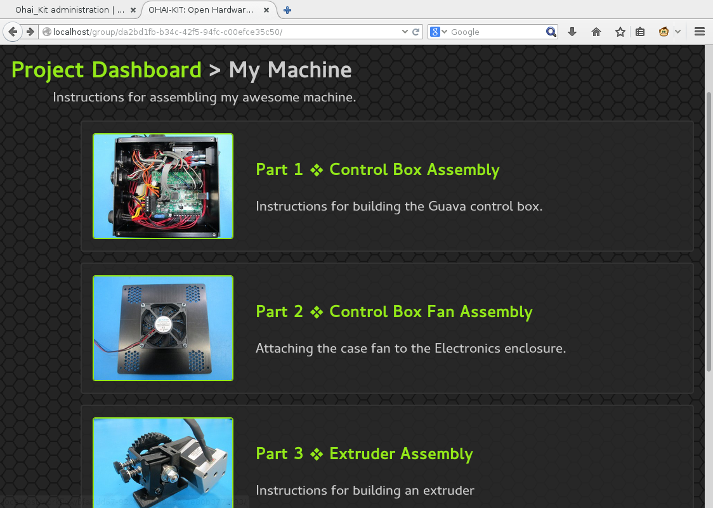

The normal mode will display the projects in this format :

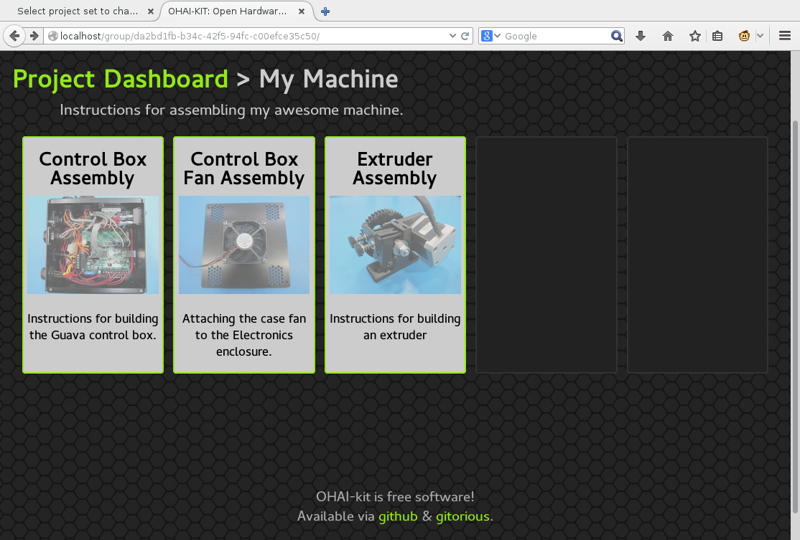

Being logged in as a worker allows the workers to access the private project sets, but not the discontinued projects. A user with the **Staff member** access will be able to view both private and discontinued projects. A *Private* project set will then appear with an orange background instead of grey, while a *Discontinued project* will appear with a black background.

## Job instances and work receipts
When a worker opens a project, he will have the option to *Begin workflow* for the project which will automatically create a new Job instance linking that user to that project at the time he started it. For every step that is then completed, a new Work Receipt is created to acknowledge the completion of that step at the time the worker completed it.
By entering the *Job instances* and *Work receipts* options in the admin interface, you can view which worker started working on which project at what time and when it was completed, as well as when each work step was completed.

## Misc ohai-kit options
Projects that are not grouped in a Project set will automatically be added to a *Miscellaneous* set. By default, that set will use the thumbnail of the first project it contains which has an image defined. To set a static image for the Miscellaneous set, add the image you want to use to the static directory of your ohai-kit installation and set its path in the **myproject/settings.py** file like so :

`OHAIKIT_MISC_GROUP_PHOTO = 'ohai_kit/misc_group.png'`

Note that the path is the relative path within the **STATIC_ROOT** directory.
